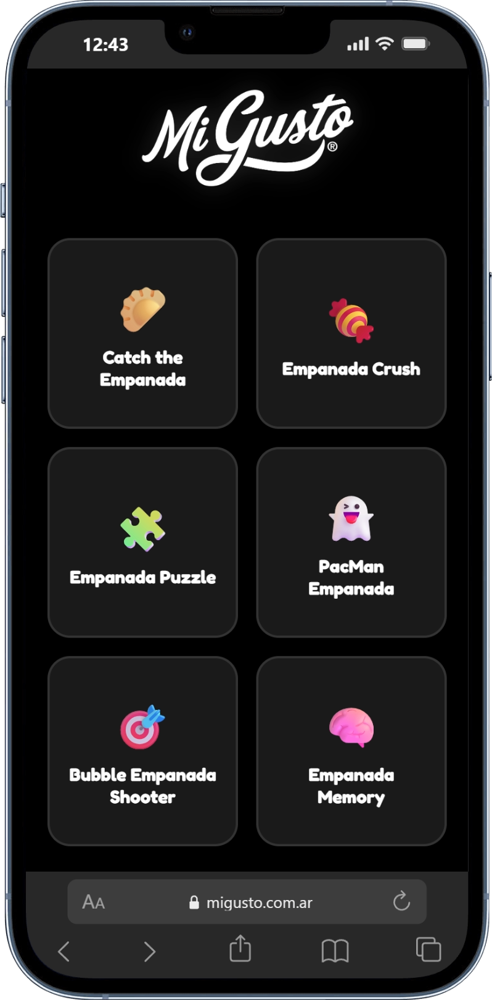
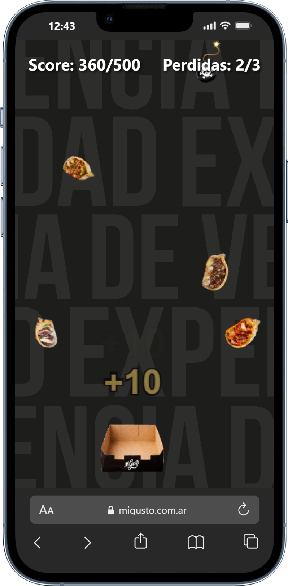
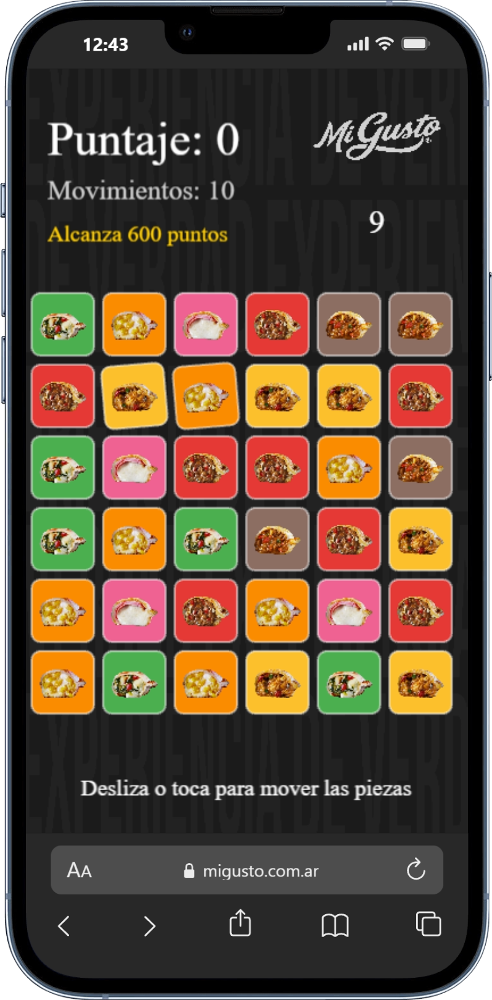
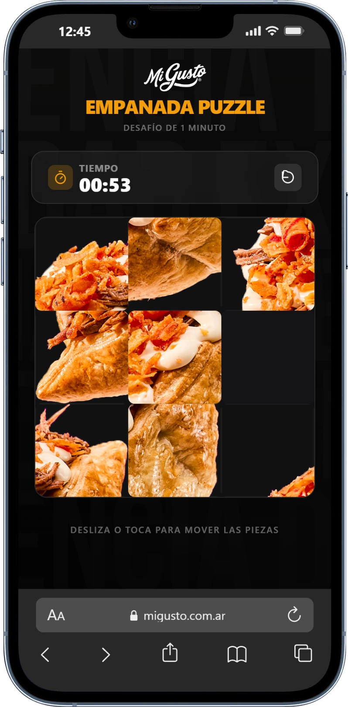
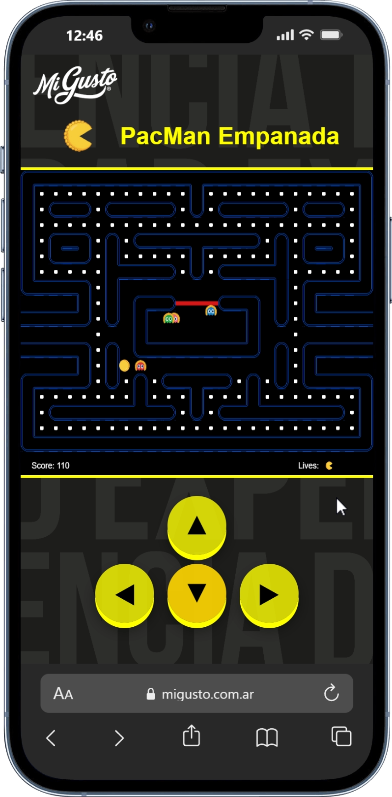
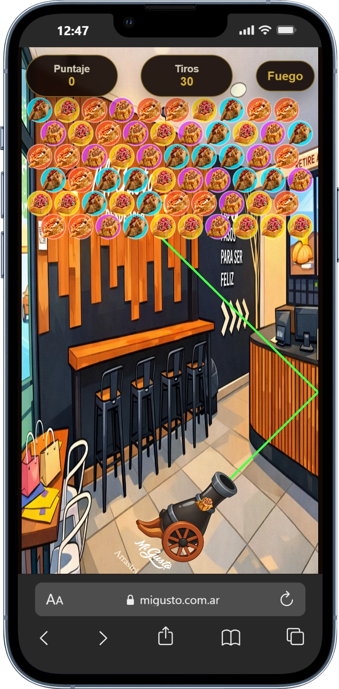
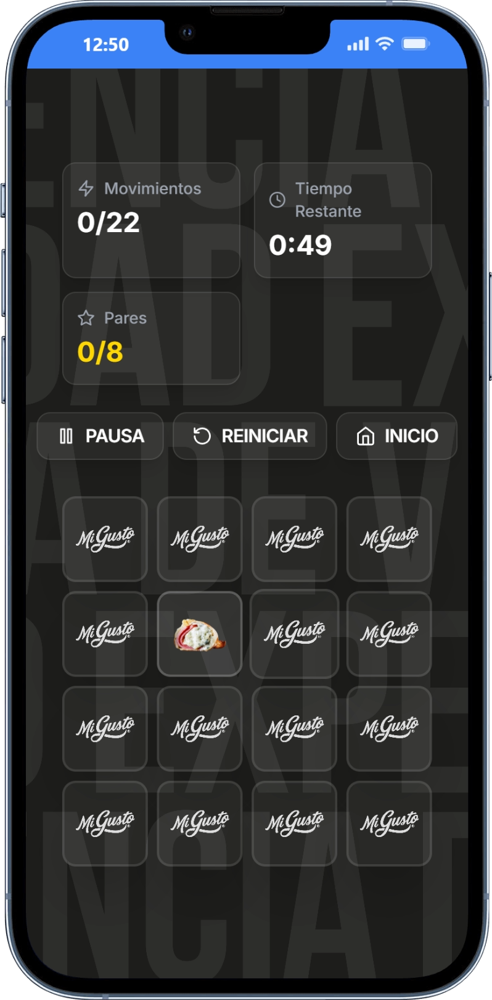

<div align="center">
  

  # 🥟 Mi Gusto — Apertura Games 🎮

  **Menú central de juegos arcade temáticos e interactivos para eventos de apertura de nuevos locales de Mi Gusto.**

  [](https://developer.mozilla.org/es/docs/Web/HTML)
  [](https://developer.mozilla.org/es/docs/Web/CSS)
  [](https://developer.mozilla.org/es/docs/Web/JavaScript)
  [](https://vitejs.dev/)
  [](https://phaser.io/)

</div>

---

## 📌 Descripción General

**Mi Gusto — Apertura Games** es una plataforma web e interfaz interactiva tipo kiosco/tótem desarrollada para amenizar y enriquecer la experiencia de los clientes durante la **apertura de nuevas sucursales de Mi Gusto**.

A través de un menú central intuitivo, los usuarios pueden seleccionar e interactuar con diversos juegos arcade temáticos inspirados en los productos icónicos de la marca.

> [!NOTE]
> La suite está optimizada para funcionar de forma **multiplataforma y adaptativa**, siendo compatible con tótems táctiles, televisores de exhibición, computadoras, dispositivos móviles y navegadores web en general.

---

## 🎮 Juegos Incluidos

Desde el portal principal (`index.html`), se ofrece acceso a 6 experiencias independientes:

| Juego | Descripción | Icono |
| :--- | :--- | :---: |
| **Catch the Empanada** | Atrapa las empanadas al vuelo evitando los obstáculos. | 🥟 |
| **Empanada Crush** | Conecta 3 o más elementos iguales en este dinámico juego Match-3. | 🍬 |
| **Empanada Puzzle** | Arma el rompecabezas temático en el menor tiempo posible. | 🧩 |
| **PacMan Empanada** | Esquiva a los fantasmas y recolecta empanadas en el laberinto clásico. | 👻 |
| **Bubble Empanada Shooter** | Dispara y explota burbujas combinando colores del mismo tipo. | 🎯 |
| **Empanada Memory** | Desafía tu memoria encontrando los pares de cartas ocultas. | 🧠 |

---

## 🖼️ Galería de Capturas

### 📱 Menú Principal (Hub Arcade)

<table width="100%">
  <tr>
    <td width="65%" align="center" valign="top">
      <b>🖥️ Menú Principal (Tótem / Kiosco)</b><br/><br/>
      
    </td>
    <td width="35%" align="center" valign="top">
      <b>📱 Menú Principal (Mobile)</b><br/><br/>
      
    </td>
  </tr>
</table>

<br />

### 🕹️ Pantallas de Juego

<table width="100%">
  <tr>
    <td width="33%" align="center" valign="top">
      <b>🥟 Catch the Empanada</b><br/><br/>
      
    </td>
    <td width="33%" align="center" valign="top">
      <b>🍬 Empanada Crush</b><br/><br/>
      
    </td>
    <td width="33%" align="center" valign="top">
      <b>🧩 Empanada Puzzle</b><br/><br/>
      
    </td>
  </tr>
  <tr>
    <td width="33%" align="center" valign="top">
      <b>👻 PacMan Empanada</b><br/><br/>
      
    </td>
    <td width="33%" align="center" valign="top">
      <b>🎯 Bubble Empanada Shooter</b><br/><br/>
      
    </td>
    <td width="33%" align="center" valign="top">
      <b>🧠 Empanada Memory</b><br/><br/>
      
    </td>
  </tr>
</table>

---

## ⚡ Características Principales

- 🖥️ **Diseño Kiosco / Tótem Arcade**: Experiencia visual atractiva en pantalla completa para locales comerciales.
- 📱 **Multiplataforma & Responsive**: Compatible con tótems táctiles, celulares, computadoras y smart TVs.
- 🎨 **Estética Temática de Marca**: Animaciones, efectos visuales e iconografía personalizada de Mi Gusto.
- 🌐 **Soporte Online / Offline**: Diseñado para funcionar de manera estable sin interrupciones.
- ⚡ **Alto Rendimiento**: Carga rápida y animaciones fluidas impulsadas por motores de juegos modernos.

---

## 🛠️ Tecnologías Utilizadas

- **Core Web**: HTML5, CSS3, JavaScript (ES6+)
- **Bundler & Dev Server**: [Vite](https://vitejs.dev/)
- **Motores de Juego & Librerías**:
  - [Phaser 3](https://phaser.io/) — Desarrollo de físicas y lógica arcade.
  - [GSAP](https://greensock.com/gsap/) — Animaciones avanzadas e interfaz interactiva.
  - [Howler.js](https://howlerjs.com/) — Gestión y reproducción de efectos de sonido.
  - [Canvas Confetti](https://github.com/catdad/canvas-confetti) — Efectos de celebración al ganar.

---

## 🚀 Instalación y Ejecución Local

Para clonar y ejecutar el proyecto en tu entorno local:

1. **Clonar el repositorio:**
   ```bash
   git clone https://github.com/ramirolacci19/MiGusto_Aperture-Games.git
   cd MiGusto_Aperture-Games
   ```

2. **Instalar dependencias:**
   ```bash
   npm install
   ```

3. **Iniciar el servidor de desarrollo:**
   ```bash
   npm run dev
   ```

4. **Construir para producción:**
   ```bash
   npm run build
   ```

---

## 👥 Desarrolladores

Desarrollado por el **Departamento de Sistemas de Mi Gusto** 🥟

| Desarrollador | Enlaces |
| :--- | :--- |
| **Facundo Carrizo** | [](https://github.com/facu14carrizo) [](https://www.linkedin.com/in/facu14carrizo) |
| **Ramiro Lacci** | [](https://github.com/ramirolacci19) [](https://www.linkedin.com/in/ramiro-lacci) |

<br />

<div align="center">
  <sub>© 2026 Mi Gusto. Todos los derechos reservados.</sub>
</div>
